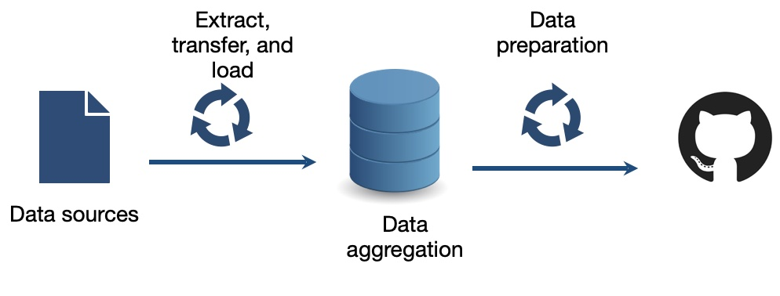

# Covid-19 Death and Infections in Germany

[CASUS-HZDR](https://www.casus.science) | CASUS. 

Untermarkt 20

D-02826 Görlitz

## Information of the data set and its origin.

We provide post-processing data of daily dead and infected COVID-19 cases for a county (Landkreise) and a state (Bundesland) level. The data are extracted from the following link [the data source](https://www.arcgis.com/sharing/rest/content/items/f10774f1c63e40168479a1feb6c7ca74/data), and subsequently transferred to the Casus-HZDR database server (see Fig above). The age-based and gender-based data are then aggregated and prepared in csv file.   

The actual data for county level is prepared on ***Actual_Germany_Counties_COVID19_Death_Infections.csv*** and its daily version is stored in Arxiv folder. The file consists of six columns such as region, name, date, dead, infected and population. The region denotes the ID of a county followed by its name in the next column. The inserted date of data is prepared in the third column followed by the number of dead and infected cases. Last but not least, the population of the county is provided in the last column. 
